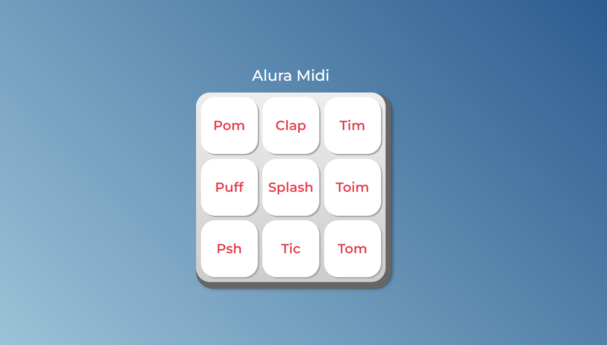

# Alura Midi
Este projeto consiste em um teclado de música interativo construído com HTML, CSS e JavaScript. O teclado simula as teclas de um instrumento musical e reproduz sons correspondentes ao serem clicadas. Além disso, o projeto oferece feedback visual ao usuário ao pressionar e soltar as teclas do teclado.

## Introdução
Este projeto oferece uma experiência interativa e divertida para os entusiastas da música e entusiastas da interatividade na web. Experimente criar suas próprias melodias e explore as possibilidades musicais deste teclado virtual!

Para mais detalhes sobre a implementação e funcionamento do projeto, consulte o código-fonte disponível neste repositório.
Aproveite e divirta-se criando música com o Teclado de Música Interativo! 🎵🎹🎶

## Recursos do Projeto
- Cada botão do teclado representa uma tecla de um instrumento musical.
- Ao clicar em um botão de tecla, um som específico associado àquela tecla é reproduzido.
- Feedback visual é fornecido ao pressionar e soltar as teclas, destacando visualmente a interação do usuário.
- Os sons são reproduzidos de forma dinâmica e responsiva, proporcionando uma experiência musical interativa.

### 📦 Tecnologias usadas
* [HTML](https://developer.mozilla.org/pt-BR/docs/Web/HTML)
* [CSS](https://developer.mozilla.org/pt-BR/docs/Web/CSS)
* [JavaScript](https://developer.mozilla.org/pt-BR/docs/Web/JavaScript)

### 👷‍♂️ Autores / Colaboradores

* **Vanessa Me Tonini** - *Instrutor Frontend do projeto* - [@vanessametonini](https://github.com/vanessametonini)
* **Arthur Cavalcante** - *Frontend do projeto* - [@Thurcavalcante](https://github.com/Thurcavalcante)

### 🔗 Deploy: [Midi](https://thurcavalcante.github.io/alura-midi/)

